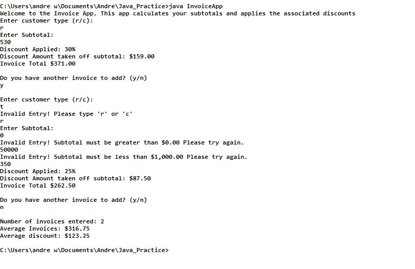

## Project Name: Invoice Application

### Assignment Date:  
1/23/18

### Developer Name:  
Andre Weir

### Project Description:
This application calculates the user's invoice and eligible discounts. The application asks the user for a customer type (r or c), and then asks for the subtotal of the invoice. The application then outputs what discount is applied, if any, the decimal value of the discount, and the final total after the discount has been applied. The application will continue to ask user if they have more invoices to enter. If the user enters more than one invoice, the final output of the application will be total number of invoices entered, the average of the final totals, and the average discount in decimal format. This application uses data validation. This application also uses static methods. 

### Screen Shot of Application:
